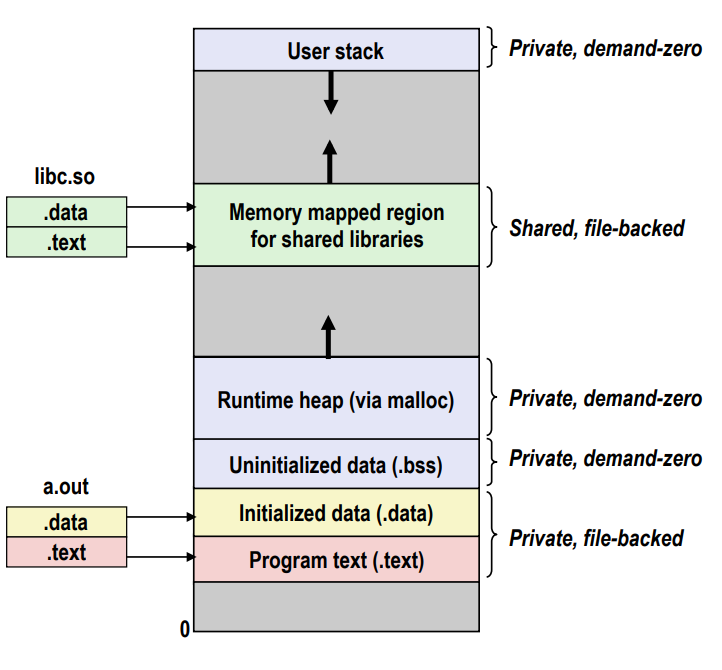
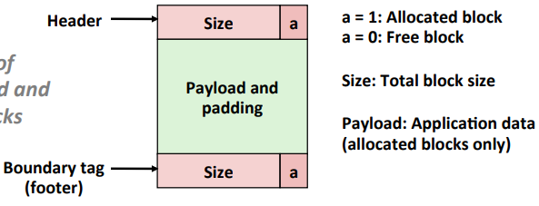
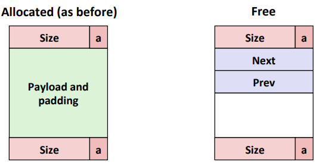
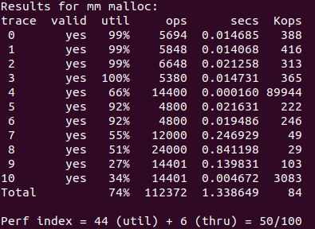
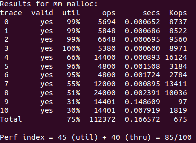

# CSAPP  malloc lab实现思路
## 要求梳理
文档要求实现一个双字对齐的分配器，主要就是要求实现他给出的以下函数:
```C
int   mm_init(void);                       // 初始化
void *mm_malloc(size_t size);              // 分配堆中空间并返回一个指针
void  mm_free(void *ptr);                  // 释放空间
void *mm_realloc(void *ptr, size_t size);  // 改变指针所指的旧块大小
```
然后文档中列了几点要求：
+ 不能调用库函数
+ 不允许定义任何全局或静态的复合数据结构，例如arrays、lists、structs等
+ 分配器必须始终返回与8字节边界对齐的指针

当然只靠它给的四个函数是无法是实现分配器的，所以我们还要定义宏和辅助函数，当然它也给出了一些可调用的辅助函数，如下：
```c
void  *mem_sbrk(int incr);                 // 扩展和收缩堆
void  *mem_heap_lo(void);                  // 堆顶指针
void  *mem_heap_hi(void);                  // 堆底指针
size_t mem_heapsize(void);                 // 堆目前大小
size_t mem_pagesize(void);                 // 返回系统的页面大小（字节）（在Linux中为4K）。
```
书中提到分配器就是要实现`吞吐率最大化`和`内存使用率最大化`，虽然二者经常相互冲突：
1. 最大化吞吐率
    + 使分配和释放请求的平均时间最小化来使吞吐率最大化
2. 最大化内存利用率
    + 使得`聚集有效载荷(aggregate payload)`比上当前堆的大小的值最大
## 知识回顾
讲到这的话，我们就先来回顾一下`堆`相关的知识
### 堆与虚拟内存
+ 每个linux进程都有属于自己的单独的虚拟地址空间，主要分为栈、共享库、堆以及.bss文件（未初始化）和.data文件（已初始化）还有代码段
+ 分配器是将堆视为一组不同大小的`块（block）`的集合来维护，每个块就是一个连续的`虚拟内存片（chunk）`，要么是已分配的，要么是空闲的，空闲块可用来分配
+ 堆是通过malloc函数（显式分配器）实现分配内存的，堆的内存并不像栈一样会被系统释放，堆通过mallo函数所分配的内存需要手动释放，如果存在过多已经不再使用的堆内存没有被释放的话，会导致堆内存溢出


### 堆块的格式
考虑到堆块合并问题，我们此处选择`带边界标记的堆块`格式
+ 由三部分构成，头部、有效载荷和填充、脚部
+ 头部和脚部均表示块大小，且脚部与下一块的头部只差一字
+ 指针从有效载荷处开始
+ 由于是8字节对齐，后三位均为0，最后一位（`分配位`）表示当前块是已分配还是空闲的


但是隐式空闲链表所用的堆块格式其实不太适合作为通用分配器的实现，更好的方法是用显示空闲链表的堆块格式，即我们用两个指针去连接空闲块，堆块格式如下图：
+ 已分配块与之前的堆块格式相同
+ 空闲块则在有效载荷处插入了两个指针`prev（前驱）`和`next（后继）`



### 块序列
1. 隐式空闲链表
    + 空闲块是通过头部中的大小字段隐含地连接着的
    + 放置分配的块时要对整个链表进行搜索，开销过大
2. 显式空闲链表
    + 用到了双向链表，使用首次适配时的搜索时间从块总数量的线性时间降低到了空闲块数量的线性时间
    + 这要求空闲块必须更大已包含所有指针和头、脚部，再加上要求对齐，这潜在提高了`内部碎片`的程度

    + 显式空闲链表有两种维护空闲链表中块的排序策略：
        1. 后进先出(LIFO)
        2. 按地址顺序
3. 分离的空闲链表
两种基本方法：
    + 简单分离存储
    + 分离适配

### 放置策略选择
#### 1. 首次适配
+ 需从头开始搜索链表从而找到合适的空闲块，时间过长
+ 易将大的空闲块保留在链表后面，也易导致起始处出现过多`小碎片（外部碎片）`
#### 2. 下一次适配
+ 从上次查询结束的地方开始搜索
+ 时间比首次适配快，但内存利用率低得多
#### 3. 最佳适配
+ 检查每个空闲块，选择适合请求大小的最小空闲块
+ 内存利用率高，但容易出现对堆进行彻底的搜索的情况

## 基本思路
我们主要就是考虑选择什么样的块序列及放置策略
### 1. 基于隐式空闲链表
书上给出了基于`隐式空闲链表`，使用`立即边界标记合并`方式，选择`首次适配`的策略实现了一个简单分配器，我们来看一下代码：
```c
#define WSIZE        4                         // 字大小以及头部、脚部大小
#define DSIZE        8                         // 双字大小
#define CHUNKSIZE   (1 << 12)                  // 堆扩展的默认大小

#define MAX(x, y) ((x) > (y) ? (x) : (y))

#define PACK(size, alloc) ((size) | (alloc))   // 将块大小和分配位进行或运算

#define GET(p)      (*(unsigned int *) (p))    // 读指针p的位置        
#define PUT(p, val) (*(unsigned int *) (p) = (val)) // 写指针p的位置

#define GET_SIZE(p)  (GET(p) & ~0x7)           // 得到块的大小
#define GET_ALLOC(p) (GET(p) & 0x1)            // 块是否已分配

// 给定块指针bp，得到它头部的指针
#define HDRP(bp) ((char *)(bp) - WSIZE)        
// 给定块指针bp，得到它脚部的指针
#define FTRP(bp) ((char *)(bp) + GET_SIZE(HDRP(bp)) - DSIZE) 

// 给定块指针bp，得到它下一个块的指针
#define NEXT_BLKP(bp) ((char *)(bp) + GET_SIZE(((char *)(bp) - WSIZE)))
// 给定块指针bp，得到它前一个块的指针
#define PREV_BLKP(bp) ((char *)(bp) - GET_SIZE(((char *)(bp) - DSIZE)))
```
这里感觉容易混淆，补充说明下：
+ GET_SIZE中用到的指针p指向`头部或脚部`，从而得到当前块大小
+ HDRP、FTRP、NEXT_BLKP、PREV_BLKP的指针bp（block pointer）则指向`有效载荷`

接下来就是我们基于隐式空闲链表所要实现的函数了，书上给出的函数如下：
```c
static void *extend_heap(size_t words);       // 用一个新的空闲块对堆进行扩展 
static void *coalesce(void *bp);              // 合并空闲块
static void *find_fit(size_t asize);          // 首次适配
static void  place(void *bp, size_t asize);   // 将请求块放置在空闲块的起始位置
```
#### 具体代码

由于书上给出的整体实现代码过长，就不一一贴出，挑几个函数讲一下
1. extend_heap函数
```c
static void *extend_heap(size_t words) {
    char  *bp;
    size_t size;
    // 保证扩展的大小是是双字对齐的
    size = (words % 2) ? (words + 1) * WSIZE : words * WSIZE;
    // 改变指针bp位置，如果堆没有足够的空闲块了，就返回-1
    if ((long)(bp = mem_sbrk(size)) == -1)
        return NULL;
    
    PUT(HDRP(bp), PACK(size, 0));             // 写入空闲块头部      
    PUT(FTRP(bp), PACK(size, 0));             // 写入空闲块脚部
    PUT(HDRP(NEXT_BLKP(bp)), PACK(0, 1));     // 将该空闲块的下一块的头部大小设定为0，且分配位设置为已分配

    // 未扩展前的堆可能以空闲块结尾，合并这两个空闲块，并返回块指针bp
    return coalesce(bp);                      
}

```
这个函数主要就是用来获得新空闲块来扩展堆，它一般在两种情况下被用到：
+ 堆被初始化时
+ mm_malloc函数没法找到一个合适的空闲块时，需要像内存系统请求额外的堆空间

2. coalesce函数(用于合并空闲块)
```c
static void *coalesce(void *bp) {
    size_t prev_alloc = GET_ALLOC(FTRP(PREV_BLKP(bp)));  // 前一个块的分配位 
    size_t next_alloc = GET_ALLOC(HDRP(NEXT_BLKP(bp)));  // 后一个块的分配位 
    size_t size = GET_SIZE(HDRP(bp));                    // 当前块的大小     

    // 情况1：前面和后面块都已分配，直接返回          
    if (prev_alloc && next_alloc) {  
        return bp;
    }

    // 情况2：前面块已分配，后面块空闲 
    else if (prev_alloc && !next_alloc) {
        size += GET_SIZE(HDRP(NEXT_BLKP(bp)));           // 当前块的大小加上后面块的大小
        PUT(HDRP(bp), PACK(size, 0));                    // 将后面块的头部大小设置为总和，分配位空闲
        PUT(FTRP(bp), PACK(size, 0));                    // 将后面块的脚部大小设置为总和，分配位空闲     
    }

    // 情况3：后面块已分配，前面块空闲 
    else if (!prev_alloc && next_alloc) {
        size += GET_SIZE(HDRP(PREV_BLKP(bp)));           // 当前块的大小加上前面块的大小
        PUT(FTRP(bp), PACK(size, 0));                    // 将前面块的脚部大小设置为总和，分配位空闲
        PUT(HDRP(PREV_BLKP(bp)), PACK(size, 0));         // 将前面块的头部大小设置为总和，分配位空闲
        bp = PREV_BLKP(bp);                              // 改变块指针bp位置，将其从当前块的有效载荷移到前面块的有效载荷处
    }
 
    // 情况4：前面和后面块都空闲
    else {
        // 前面块和后面块的大小都加上
        size += GET_SIZE(HDRP(PREV_BLKP(bp))) + GET_SIZE(FTRP(NEXT_BLKP(bp)));  
        PUT(FTRP(NEXT_BLKP(bp)), PACK(size, 0));         // 将后面块的脚部大小设置为总和，分配位空闲     
        PUT(HDRP(PREV_BLKP(bp)), PACK(size, 0));         // 将前面块的头部大小设置为总和，分配位空闲
        bp = PREV_BLKP(bp);                              // 改变块指针bp位置，将其从当前块的有效载荷移到前面块的有效载荷处
    }
    return bp;
}
```
3. place函数(用于放置请求块并分割空闲块)
```c
static void place(void *bp, size_t asize) {
    size_t csize = GET_SIZE(HDRP(bp));

    // 当请求块的大小与当前块大小之差（即剩余块）大于16字节时，才进行分割
    if ((csize - asize) >= 2*DSIZE) {
        PUT(HDRP(bp), PACK(asize, 1));
        PUT(FTRP(bp), PACK(asize, 1));
        bp = NEXT_BLKP(bp);
        PUT(HDRP(bp), PACK(csize - asize, 0));
        PUT(FTRP(bp), PACK(csize - asize, 0));
    }
    
    else {
        PUT(HDRP(bp), PACK(csize, 1));
        PUT(FTRP(bp), PACK(csize, 1));
    }
}

```
该方法的整体缺点：
+ 带有边界标记的块利于我们合并，但是由于需保持多个头部和脚部，会带来显著的内存开销
+ 隐式空闲链表在分配请求块时，搜索时间过长，花费成本过高
+ 立即合并空闲块会导致每释放一个块，就会合并相邻块，有时候会出现抖动，块反复合并又马上分割

[完整代码见仓库](https://github.com/qaok/csapp/blob/master/malloclab/malloclab-handout/mm1.c)
### 2. 基于分离的空闲链表
隐式空闲链表的搜索效率实在太低，我们尝试一下分离空闲链表，书上有提到关于分离适配的简单版本：即分配器维护着`一个空闲链表的数组`，每个链表是和一个大小类相关联的，并且被组织成某种类型的显式或隐式链表。每个链表包含潜在的大小不同的块，这些块的大小是大小类的成员。

为了分配一个块，必须确定请求的大小类，并且对适当的空闲链表做首次适配，查找一个合适的块。如果找到了，就切割它，并将剩余部分插入到适当的空闲链表中。找不到就搜索下一个更大的大小类的空闲链表。如此重复直至找到合适块，若链表中没有合适块就向操作系统请求额外堆内存。释放块时，对块进行合并。

此处我们使用`显式空闲链表`，并使用`分离适配`的方法来实现分配器，同时我们使用`后进先出（LIFO）`的策略来维护空闲链表，放置策略则选择了`首次适配`，同时也实现了`最佳适配`，堆块格式我们选择前面所提到的第二种堆块格式，先来看看实现思路：

+ 除了前面已经定义的宏，我们还要补充几个：
```c
// 每个空闲链表的头结点
#define HEAD(num)     (heap_listp + WSIZE * num)
// 不同空闲链表头结点存放的第一个块的地址
#define GET_HEAD(num) ((char *)(long)(GET(HEAD(num))))
// 空闲块的前驱指针
#define GET_PREV(bp)  ((char *)(long)(GET(bp)))
// 空闲块的后继指针
#define GET_NEXT(bp)  ((char *)(long)(GET((char *)bp + WSIZE)))
        
#define LIST_SIZE 16                    // 链表数目
#define INIT_SIZE (LIST_SIZE * WSIZE)   // 链表初始化大小 
```
+ 辅助函数也要另外增加两个，下面是辅助函数：
```c       
static void *best_fit(size_t asize);    // 最佳适配
static void  delete(void *bp);          // 删除空闲块   
static void  insert(void *bp);          // 插入空闲块  
static int   search(size_t size);       // 确定链表顺序
```

#### 具体代码
这次的实现方法中新增了delete、insert、search和best_fit等函数，其余函数变化均不大，因此我们就重点来看看新增的函数
1. delete函数
```c
static void delete(void *bp) {
    size_t size = GET_SIZE(HDRP(bp));
    int num = search(size);
    char* prev = GET_PREV(bp);
    char* next = GET_NEXT(bp);

    // 此时说明该链表有且仅有这一个空闲块
    if (prev == NULL && next == NULL) {
        PUT(free_list[num], NULL);
    }

    // 此时为链表的最后一个节点即尾结点
    else if (prev != NULL && next == NULL) {
        PUT(prev + WSIZE, NULL);
    }

    // 此时为链表的头节点
    else if (prev == NULL && next != NULL) {
        PUT(free_list[num], next);
        PUT(next, NULL);
    }
    
    // 既不为头节点也不是尾结点
    else if (prev != NULL && next != NULL) {
        PUT(prev + WSIZE, next);
        PUT(next, prev);
    }
}
```
2. insert函数
```c
static void insert(void *bp) {
    size_t size = GET_SIZE(HDRP(bp));        
    int num = search(size);                   // 确定该空闲块应属于哪个大小类
    if (GET_HEAD(num) == NULL) {              // 此种情况为链表为空，无任何空闲块
        PUT(free_list[num], bp);
        PUT(bp, NULL);                        // 前驱
        PUT((char *)bp + WSIZE, NULL);        // 后继
    } else {
        // 注意：我们采用的是后进先出（LIFO）策略，因此新块永远位于链表开始处
        // 将原来头节点设为bp的后继
        PUT((char *)bp + WSIZE, GET_HEAD(num));
        // 将链表头节点的前驱设为bp
        PUT(GET_HEAD(num), bp);
        // bp的前驱为空
        PUT(bp, NULL);
        // 更新链表头节点为bp
        PUT(free_list[num], bp);
    }
}
```
3. search函数
```c
static int search(size_t size) {
    for (int i = 4; i <= 18; i++) {
        if (size <= (1 << i))          // 2 **（i-4）
            return i - 4;
    }
    return 15;
}
```
4. best_fit函数
```c
static void *best_fit(size_t asize) {
    size_t size_gap = 1 << 30;         // 先定一个块的大小差
    int num = search(asize);
    char *bp;
    char *best_addr = NULL, *temp;
    for (; num < LIST_SIZE; num++) {
        for(bp = GET_HEAD(num); bp != NULL; bp = GET_NEXT(bp)) {
            temp = HDRP(bp);
            // 此时逐步更新大小差，确保是最小的大小差
            if (GET_SIZE(temp) - asize < size_gap) {
                size_gap = GET_SIZE(temp) - asize;
                best_addr = bp;
                if (GET_SIZE(temp) == asize) return best_addr;
            }
        }
    }
    return best_addr;
}
```
当数据量足够大的时候，分离的空闲链表的效率比隐式链表要高出太多

分离适配方法是一种很常见的选择，因为它搜索时间短，内存利用率也不低

[完整代码见仓库](https://github.com/qaok/csapp/blob/master/malloclab/malloclab-handout/mm.c)
## 代码测试
### 1. 隐式空闲链表
测试结果如下：

只得到50分，效果很一般，因此我们不考虑使用这种方法
+ 
### 2. 分离的空闲链表
1. 用最佳适配的结果如下：有85分
+ 

2. 用首次适配的结果如下：
+ 

